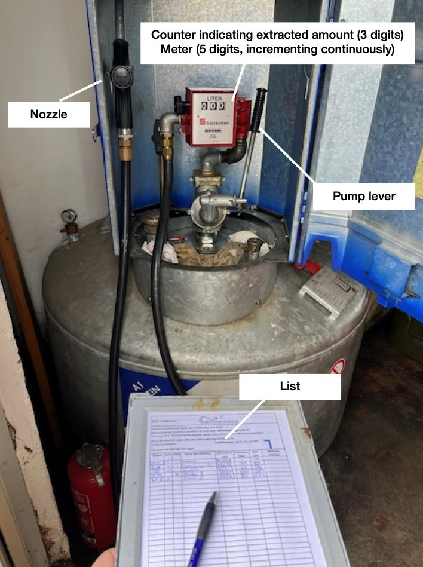

# Refuel - Tank App

This is a demo project for exploring the concept of event souring and the new database system [EventSourcingDb](https://docs.eventsourcingdb.io/) from [the native web](https://www.thenativeweb.io/).

Key aspects:
- A .NET client SDK project for interacting with EventSourcingDb (EventSourcingDbClient, EventSourcingDbClient.Tests) 
- The business project making use of the SDK (Core, Core.Tests)

Due to the short amount of time, there is no UI project and integration tests serve as POC.
They can be run with `dotnet test`, the only prerequisites are .NET 9 SDK being installed and a running docker daemon.

## Business domain

TL;DR  ⛽➡🧃➡🛩️

### Introduction

At our local aero club, we use big tanks for storing fuel (see image at the bottom of the page).
When refueling aircraft, we fill up smaller canisters from that big tank and move them to the hangars.
The extraction of fuel is tracked with a list containing columns for name, date, amount of fuel extracted, meter value after extraction and remaining fuel. 
When the remaining fuel reaches a certain level, a contact person reaches out to a company for refilling the tank. 
The refilling is tracked by starting a new list.

Digitalizing this process with an app has both benefits and drawbacks and might be over-engineering. 
However, it makes a perfect business domain for experimenting with event sourcing due to it's approachability and low complexity.

### Domain Events

The lifecycle of possible domain events would be in logical/chronological order:

| Event                   | Subject           | Data                                                | Comment                                                                                                                                                                    |
| ----------------------- |-------------------|-----------------------------------------------------|----------------------------------------------------------------------------------------------------------------------------------------------------------------------------|
| Tank registered         | tanks/\<id>       | name,  clubId,  description,  capacity,  fuelLevel | Suppose the app is used to manage many tanks.                                                                                                                              |
| Meter initialized       | tanks/\<id>/meter |                                                     | Suppose the meter is an optional physical feature of a tank and tanks without meters shall be supported.                                                                   |
| Meter read              | tanks/\<id>/meter | currentMeterValue                                   | Only possible after meter initialization                                                                                                                                   |
| Fuel extracted          | tanks/\<id>       | amount                                              |                                                                                                                                                                            |
| Refilling requested     | tanks/\<id>       |                                                     | Might trigger sending automated emails. Useful to let users know refilling is happening. Pilots are getting nervous on fuel shortage both in the air and on the ground! 😉 |
| Tank refilled           | tanks/\<id>       | newFuelLevel                                        |                                                                                                                                                                            |
| Tank set our of service | tanks/\<id>       |                                                     |                                                                                                                                                                            |

The tank itself at any given time would have the following properties:

- Id
- ClubId
- Name
- Description
- Capacity
- Meter with current value (if meter is initialized)
- FuelLevel
- RefillRequested

## Notes on the approach

- **CQRS** - works very well with event sourcing.
[MediatR](https://github.com/jbogard/MediatR) is an excellent library to achieve loose coupling, improve testability while providing extensibility.
- **Clean Architecture** - due to the experimental character of this project, the dependency inversion principle is not applied.
Actually, with event sourcing, the domain seems to rely much more on the infrastructure than with the usual abstract repositories and filter expressions.
It would be interesting to discuss whether an abstraction layer makes sense or not.
There are not much event sourcing databases out there to exchange anyways.
- **GraphQL** - Unrelated, used out of personal interest.

 
 

